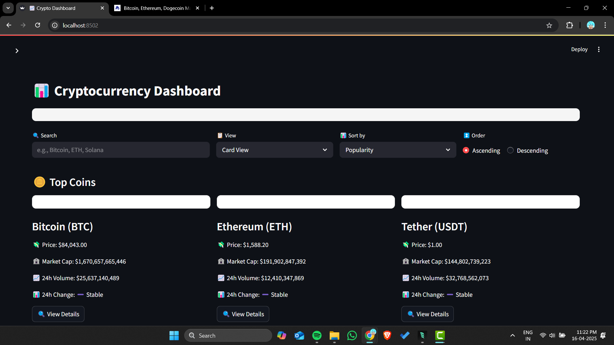
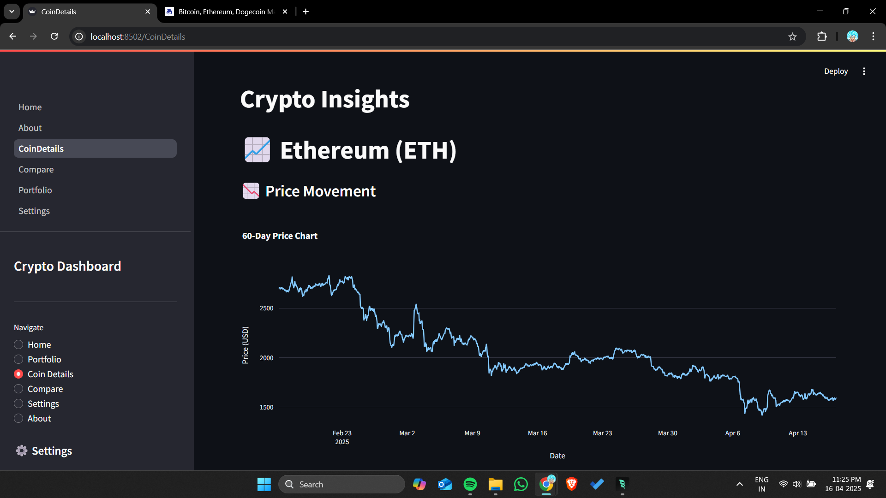
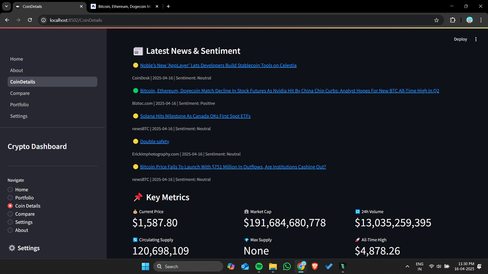
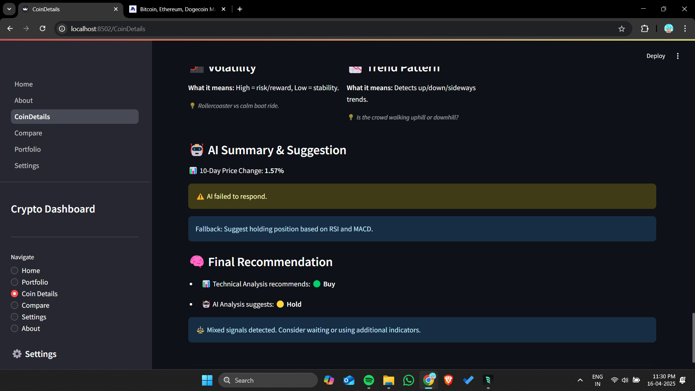
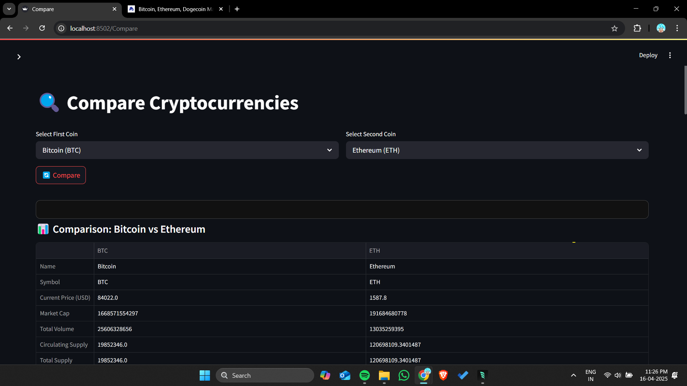
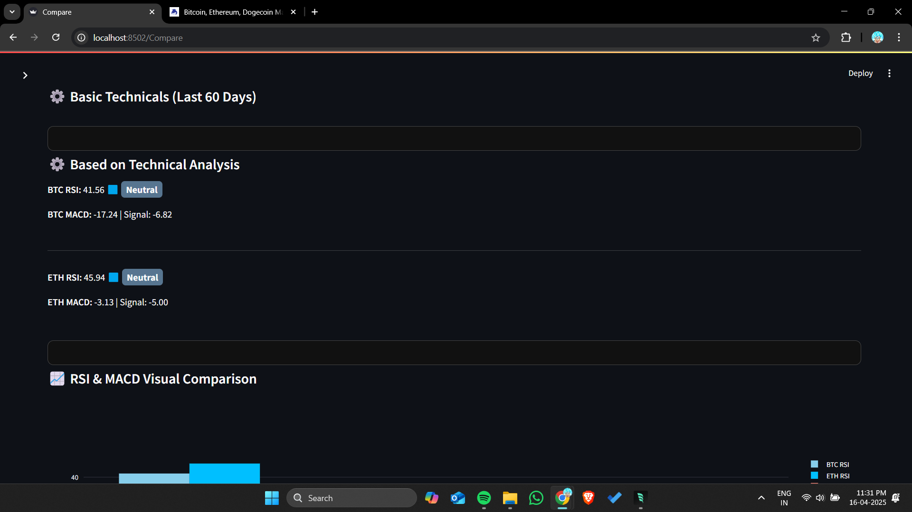
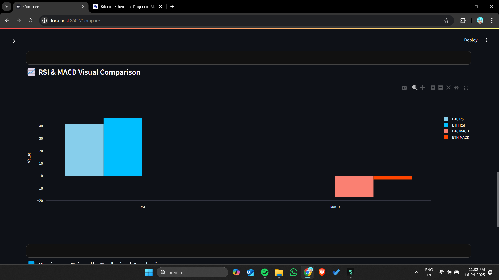
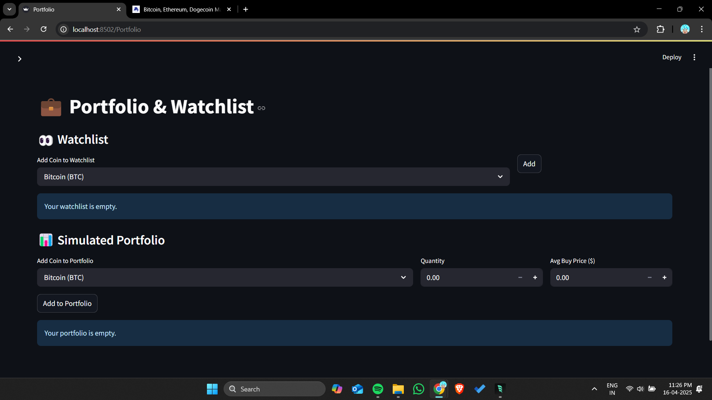
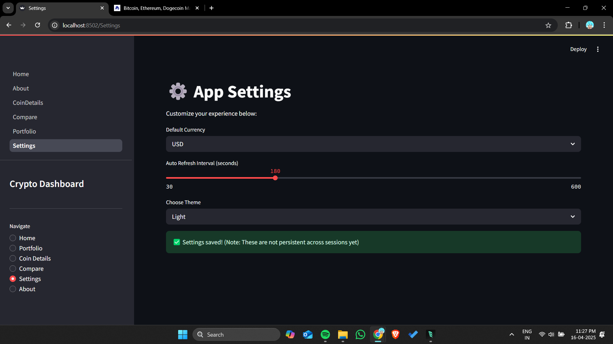

# 💹 Crypto Live Dashboard

🎥 **Watch the demo video on [LinkedIn](https://www.linkedin.com/posts/nisarg-zaveri_crypto-python-ai-activity-7318483666244890624-kLDc?utm_source=share&utm_medium=member_desktop&rcm=ACoAACiELHABqqbC_jOmZCbb6r9Lq9uDbKRiSeY)**

A modern, interactive Streamlit application that provides real-time cryptocurrency data, technical analysis, and AI-driven insights.

---

## 🚀 Features

- **Real-time Data:** Fetches live prices, market cap, volume, and supply metrics.
- **Technical Indicators:** Calculates RSI, MACD, SMA, EMA, Bollinger Bands, and Stochastic Oscillator.
- **AI Insights:** Uses a HuggingFace model to generate a summary and recommendation.
- **Beginner-Friendly Explanations:** Visual cards explaining key indicators in simple terms.
- **Compare Mode:** Side-by-side comparison of multiple coins with visual charts.
- **Portfolio & Watchlist:** Track holdings and watch your favorite coins.
- **Customizable Settings:** Set default currency, refresh interval, and theme.
- **Responsive UI:** Collapsible sidebar to maximize chart area.

---

## 📦 Tech Stack & Dependencies

- **Python 3.8+**
- **Streamlit** for web UI
- **Pandas** for data processing
- **Plotly** for interactive charts
- **st-aggrid** for grid views
- **Requests** for external API calls
- **HuggingFace API** for AI summaries

Install dependencies:

```bash
pip install -r requirements.txt
```

---

## 🛠️ Installation & Setup

1. **Clone the repo**
```bash
git clone <repo_url>
cd "Crypto Live Dashboard"
```
2. **Install requirements**
```bash
pip install -r requirements.txt
```
3. **API Keys**
   - Create a `.streamlit/secrets.toml` file:
     ```toml
     [huggingface]
     HF_API_TOKEN = "YOUR_HF_API_TOKEN"
     ```
4. **Run the app**
```bash
streamlit run Home.py
```

---

## 🔍 Folder Structure

```
Crypto Live Dashboard/
├── Home.py                   # Main entry point
├── pages/                    # Streamlit multipage folder
│   ├── About.py
│   ├── CoinDetails.py
│   ├── Compare.py
│   ├── Portfolio.py
│   └── Settings.py
├── data_fetcher.py           # Coin data retrieval
├── news_fetcher.py           # News & sentiment analysis
├── utils.py                  # Indicator calculations
├── huggingface_ai.py         # AI prompt & response
├── portfolio_storage.py      # Persistence helpers
├── requirements.txt
├── assets/                   # Images & screenshots
└── README.md
```

---

## 🔧 Configuration

- **Default Currency** & **Refresh Interval** managed via the Settings page.
- **HuggingFace Token** stored in `secrets.toml`.
- **Sidebar State** toggles collapsed/expanded by default.

---

## 📸 Screenshots

### Home Dashboard



### Coin Details






### Compare View





### Portfolio & Watchlist



### Settings Page



---

## 🤝 Contributing

Contributions are welcome! Please open an issue or submit a pull request.

---

## 📄 License

MIT License. See [LICENSE](LICENSE) for details.

---

## ✉️ Contact

Created by Nisarg Zaveri. Questions? Reach out at [npzaveri008@gmail.com].
